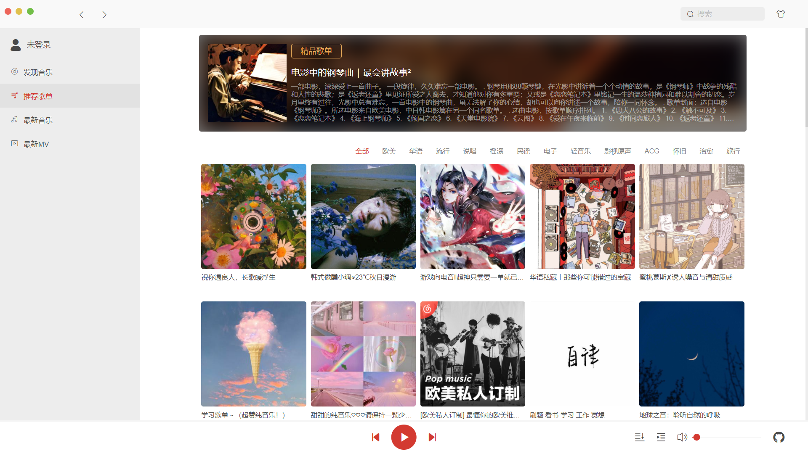

# 基于Vue2、Vue-CLI4的音乐播放器

这是一个高仿mac端网易云的音乐播放器，目前只开发了一部分功能，我会努力开发完这个项目的。


### [源码地址](https://gitee.com/uyc/vue-cloudmusic)


### 进度

- [x] 最新音乐
- [x] 主题换肤
- [x] 歌单详情
- [x] 最新歌单
- [x] 发现音乐


### 相关技术栈
- Vue全家桶
- Element-ui魔改样式
- CSS Variables实现主题换肤
- Sass
- postcss-pxtorem 自动计算rem，实现移动端适配


### 后端接口

https://binaryify.github.io/NeteaseCloudMusicApi


### 项目目录结构

``` 
├── public 
|   ├── favicon.ico ·····网站图标
|   └── index.html ······模板HTML文件
├── src
|   ├── api ·············api接口
|   ├── assets ··········静态资源
|   ├── base ············基础组件
|   ├── components ······业务组件
|   ├── plugin ··········组件注册（基础组件和Element组件）
|   ├── router ··········路由 
|   ├── store ···········vuex
|   ├── style ···········样式文件
|   |   └── themes ··········切换主题的样式文件
|   └── utils ···········js工具集
├── App.vue ·············vue页面入口文件
└── main.js ·············vue程序入口文件
```


### 效果预览




### 安装与使用
```bash
npm install
npm run serve
```

### 致谢
这个音乐播放器项目的开发过程是跟进一个 [开源项目](https://github.com/sl1673495/vue-netease-music) ，在这个开源项目的基础上对代码做了一点小改动。这个开源项目中有很多知识点让我受益匪浅，在这里感谢这位老哥的开源。