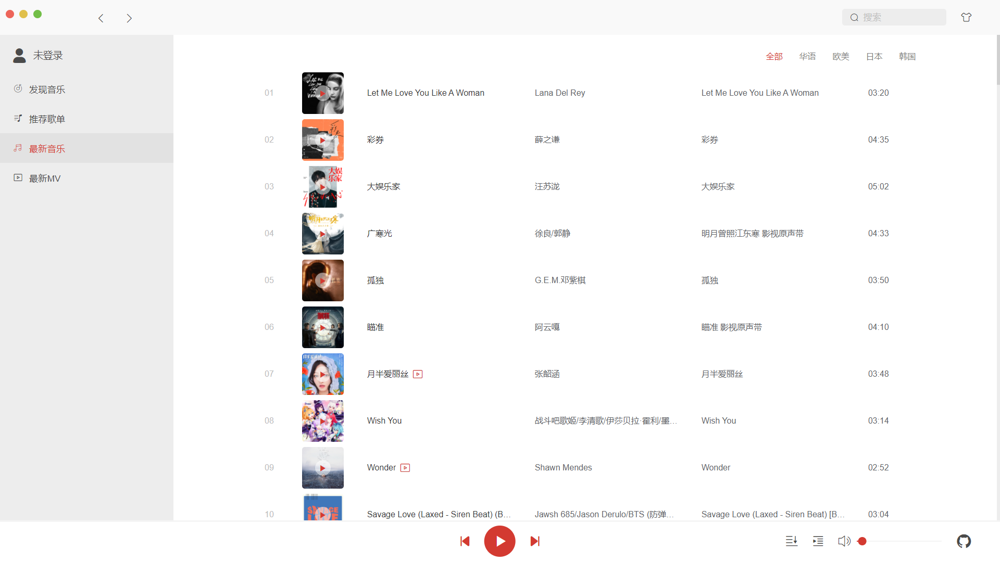
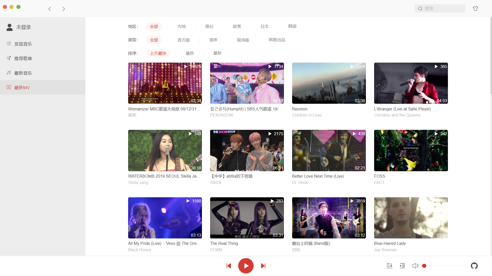
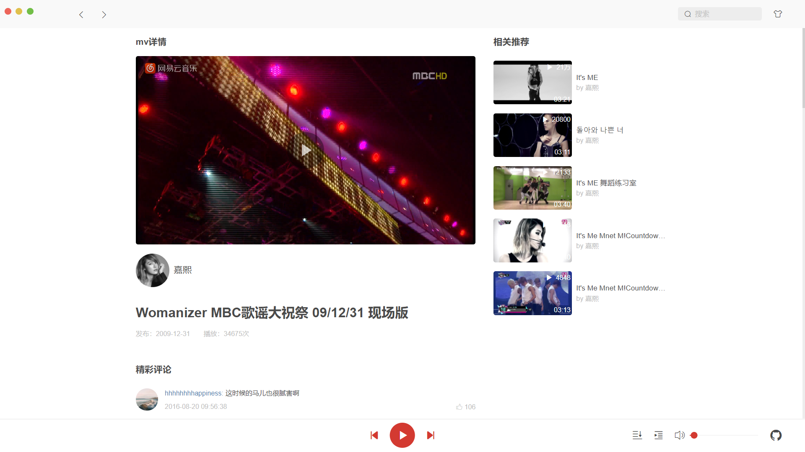

# vue-cloudmusic

使用Vue-CLI4构建的Vue2项目，仿网易云客户端实现歌曲播放、歌单搜索、mv播放等功能。

### 预览

[预览地址](8.131.67.237) 

### 安装与使用
```bash
npm install
npm run serve
```

### 项目主要功能

- [x] 搜索功能
- [x] 用户登录
- [x] 播放列表 & 播放记录
- [x] 歌词及评论
- [x] mv详情及播放
- [x] 最新MV
- [x] 最新音乐
- [x] 主题换肤
- [x] 歌单详情
- [x] 最新歌单
- [x] 发现音乐

### 相关技术栈
- Vue全家桶
- axios
- Element-ui
- Sass
- better-scroll
- postcss-pxtorem


### 后端接口
接口使用github上大佬的开源项目（ 项目地址：https://binaryify.github.io/NeteaseCloudMusicApi ）


### 本项目源码地址
https://github.com/uyc/vue-cloudmusic

### 项目目录结构

``` 
├── public 
|   ├── favicon.ico ·····网站图标
|   └── index.html ······模板HTML文件
├── src
|   ├── api ·············api接口
|   ├── assets ··········静态资源
|   ├── base ············基础组件
|   ├── components ······业务组件
|   ├── plugin ··········组件注册（基础组件和Element组件）
|   ├── router ··········路由 
|   ├── store ···········vuex
|   ├── style ···········样式文件
|   |   └── themes ··········切换主题的样式文件
|   └── utils ···········js工具集
├── App.vue ·············vue页面入口文件
└── main.js ·············vue程序入口文件
```


### 效果预览








### 致谢
[vue-netease-music](https://github.com/sl1673495/vue-netease-music)  
[NeteaseCloudMusicApi](https://binaryify.github.io/NeteaseCloudMusicApi)
